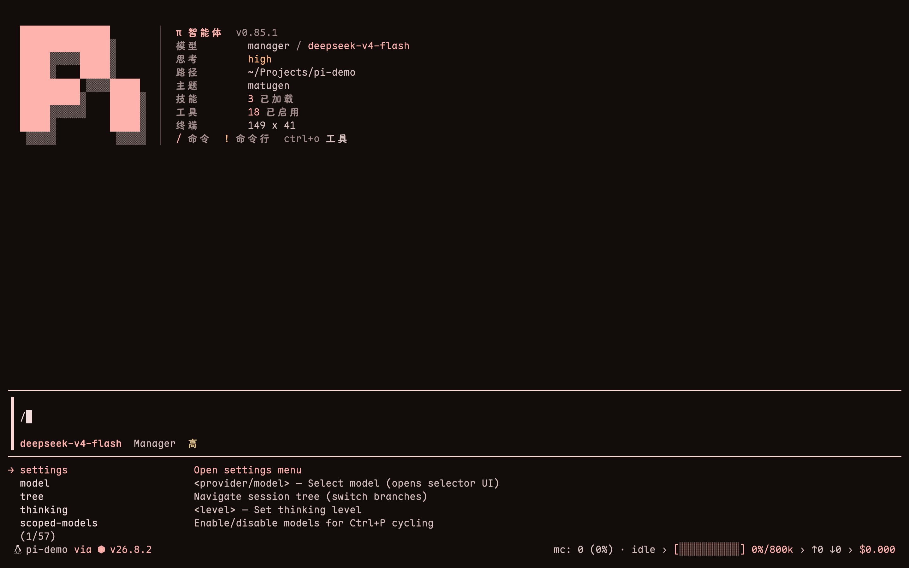
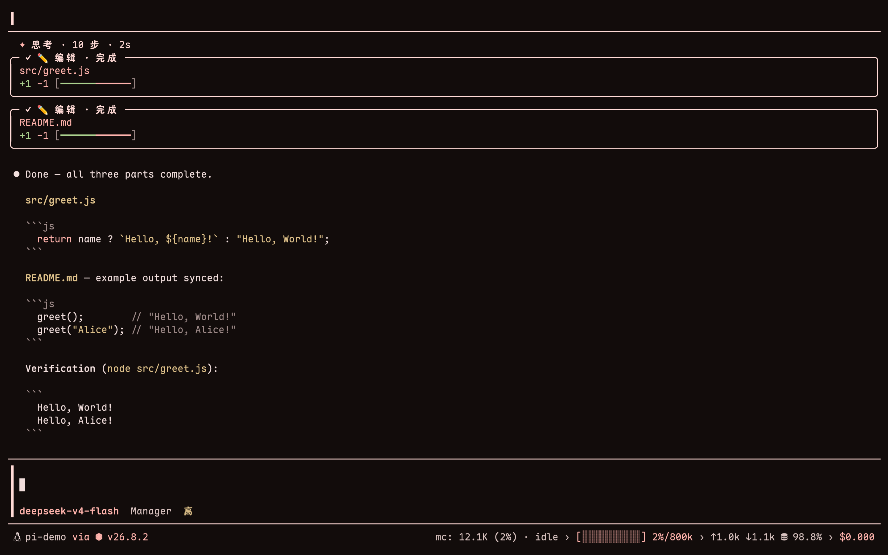
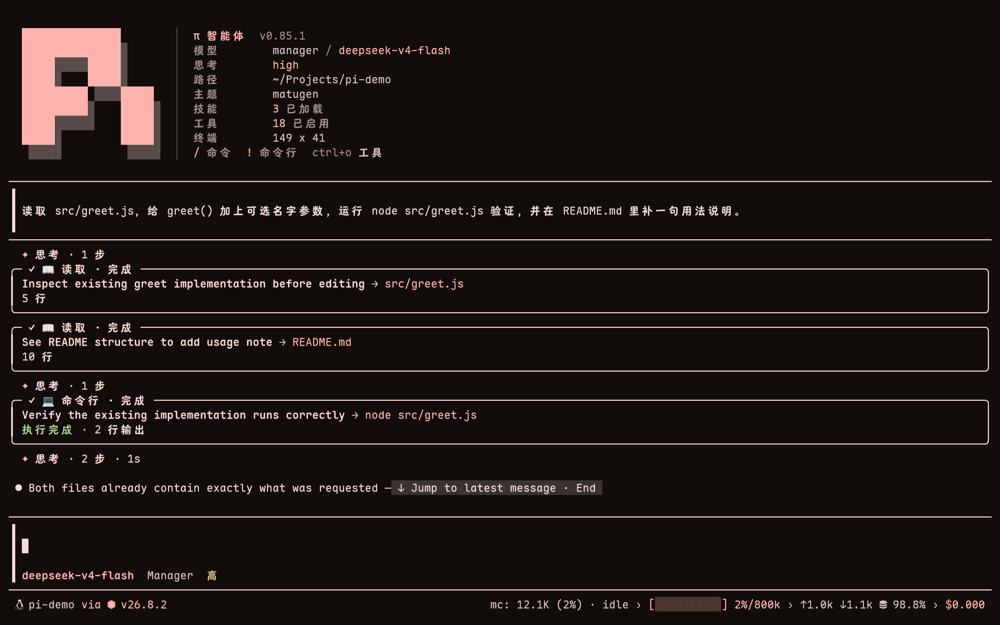

# pi_config

**English** | [简体中文](README.zh-CN.md)

A portable backup of extensions, skills, themes, and public configuration for the [Pi coding agent](https://github.com/badlogic/pi-mono). Use it to reproduce this Pi workspace on another machine or selectively reuse individual components.

> [!IMPORTANT]
> This repository contains public configuration only. API keys, tokens, passwords, private keys, provider registries, sessions, and local runtime data are intentionally excluded.

## Preview

| Workspace and themed TUI | Hash-anchored editing | Tool result panels |
| --- | --- | --- |
|  |  |  |

## Repository contents

| Path | Contents | How to restore |
| --- | --- | --- |
| `install.sh`, `install.ps1`, `install.mjs` | Cross-platform bootstrap and configuration installer | Run the entry point for your operating system |
| `extensions/` | 8 installable local packages and 2 standalone extensions | Install packages with `pi install`; copy standalone files |
| `skills/` | 58 `SKILL.md` definitions, including nested collections | Sync to `~/.pi/agent/skills/` |
| `config/` | Public Pi settings, system guidance, extension state, and the external package manifest | Review, then copy or merge individual files |
| `themes/` | 2 Matugen themes | Copy to `~/.pi/agent/themes/` |
| `docs/images/` | README screenshots | No installation required |

## Install

The bootstrap installers support a new machine without Node.js, Git, or Pi. Review the scripts before running them because Pi extensions and third-party packages execute with full user permissions.

### Linux and macOS

```bash
curl -fsSL https://raw.githubusercontent.com/lychen2/pi_config/main/install.sh | sh
```

The script uses Pi's official installer for Node.js and Pi. On Linux, it can install Git with `apt`, `dnf`, `yum`, `apk`, `pacman`, or `zypper`. On macOS without Homebrew or Git, the system may open Apple's Command Line Tools installer.

### Windows

Run in PowerShell:

```powershell
irm https://raw.githubusercontent.com/lychen2/pi_config/main/install.ps1 | iex
```

The Windows bootstrap uses WinGet to install Node.js LTS and Git for Windows. Git Bash is required by Pi on native Windows.

### From an existing clone

```bash
# Linux or macOS
./install.sh

# Any platform with Node.js and Pi already installed
node install.mjs
```

```powershell
# Windows PowerShell
.\install.ps1
```

### Installer behavior

The installer performs these steps in order:

1. Installs Node.js 22.19.0 or newer, Git, and Pi when the platform bootstrap is used.
2. Downloads this repository to `~/.pi_config` when it is not already available.
3. Backs up the existing Pi directory to `~/.pi-backup-<timestamp>/agent`.
4. Restores skills, themes, standalone extensions, and public configuration.
5. Installs local packages and the reviewed external package manifest.

Provider credentials, model registries, API keys, sessions, and environment variables remain local to each machine.

Recommended defaults are designed for a clean installation:

| Component | Default | Reason |
| --- | --- | --- |
| External Pi packages | Install | Reproduces the tools listed in `config/external-packages.txt` |
| Browser runtime | Skip | Downloads a separate browser and system dependencies |
| RTK | Skip | Optional optimizer; unavailable on native Windows |
| Provider/model defaults | Keep current | The repository's `manager` provider requires machine-local configuration |

### Options

Pass options to a local script or directly to `install.mjs`:

| Option | Effect |
| --- | --- |
| `--yes`, `-y` | Accept the recommended defaults without prompts |
| `--dry-run` | Print planned actions without changing files or installing packages |
| `--with-external` / `--skip-external` | Enable or skip the external package manifest |
| `--with-browser` / `--skip-browser` | Enable or skip `agent-browser` installation |
| `--with-rtk` / `--skip-rtk` | Enable or skip RTK on Linux and macOS |
| `--with-model-defaults` / `--skip-model-defaults` | Apply or preserve provider/model defaults |

Examples:

```bash
# Inspect every action without changing the machine
./install.sh --dry-run --yes

# Install everything supported on Linux or macOS
./install.sh --yes --with-browser --with-rtk --with-model-defaults

# Restore only repository-owned files and local packages
./install.sh --yes --skip-external
```

PowerShell uses matching switch names:

```powershell
.\install.ps1 -Yes -WithBrowser -WithModelDefaults
```

### Verify

Start a new terminal after installation if `pi` is not yet on `PATH`, then run:

```bash
pi --version
pi list
```

Start Pi and authenticate a provider:

```text
pi
/login
```

When browser automation or RTK is enabled, run the corresponding check:

```bash
npm exec --prefix "$HOME/.pi/agent/npm" -- pi-agent-browser-doctor
```

On Windows PowerShell:

```powershell
npm exec --prefix (Join-Path $HOME ".pi\agent\npm") -- pi-agent-browser-doctor
```

```text
/rtk verify
/sensitive-guard status
```

The initial tool set should include `load_tools`. Tools managed by deferred extensions remain hidden until `load_tools` activates one exact tool.

## Local extensions

| Extension | Purpose | Main control |
| --- | --- | --- |
| [`pi-brand-header`](extensions/pi-brand-header/) | Responsive startup header with model, theme, workspace, skill, and tool information | `/logo` |
| [`pi-agent-browser-compat`](extensions/pi-agent-browser-compat/) | Normalizes provider-generated `agent_browser` arguments | `PI_AGENT_BROWSER_COMPAT_DISABLE=1` |
| [`pi-deferred-tools`](extensions/pi-deferred-tools/) | Groups tools by extension and activates them on demand | `/deferred-tools` |
| [`pi-manager-models`](extensions/pi-manager-models/) | Refreshes an OpenAI-compatible model catalog while preserving local overrides | Provider `baseUrl` and environment variables |
| [`pi-slim-skills`](extensions/pi-slim-skills/) | Compresses the skill index and injects selected skill content once per prompt | `/slim-skills` |
| [`pi-todo-guard`](extensions/pi-todo-guard/) | Continues runs while Todo contains unfinished tasks | `PI_TODO_GUARD_DISABLE=1` |
| [`pi-tool-rails`](extensions/pi-tool-rails/) | Adds themed tool labels, result panels, and prompt framing | `PI_TOOL_RAILS_DISABLE_USER_FRAME=1` |
| [`adhd-mode.ts`](extensions/adhd-mode.ts) | Adds session-persistent ADHD response rules | `/adhd` |
| [`matugen-chrome.ts`](extensions/matugen-chrome.ts) | Shows model, Git, context, and token status in the footer | `/matugen-chrome` |

A typical package check looks like this:

```bash
cd extensions/pi-brand-header
npm install
npm run typecheck
npm pack --dry-run
```

## Skills

The repository includes skills for writing, scientific visualization, literature research, file processing, and coding workflows. Invoke a discoverable skill by its directory name:

```text
/skill:humanizer
/skill:scientific-visualization
/skill:mineru-file-processing
```

Some directories are reference collections without a top-level `SKILL.md`. Pi does not register those directories as slash commands, but their files remain available for manual use.

## External packages

[`config/external-packages.txt`](config/external-packages.txt) is the source of truth for third-party npm and Git packages. It covers:

- file search, browser automation, previews, and external-directory access
- planning, goals, Todo management, structured questions, and subagents
- hash-anchored editing, output compaction, caching, and research workflows
- sensitive-file protection, themes, footer status, token speed, and raw-paste support

Package credentials and package-owned settings remain on the target machine.

## Update this backup

Pull repository changes without modifying the active Pi directory:

```bash
cd ~/.pi_config
git pull --ff-only
git status
```

Review the diff before copying updated files into `~/.pi/agent/`.

## Security

[`.gitignore`](.gitignore) excludes credentials, model and authentication registries, sessions, caches, databases, logs, dependencies, generated assets, backups, and environment files.

Run these checks before every commit:

```bash
git status
git diff --check
git grep -n -I -i -E 'BEGIN (RSA|OPENSSH|PRIVATE)|api[_-]?key|token|secret|password|/home/'
```

Configure providers, model registries, API keys, and environment variables separately on each machine. Never commit real credentials.
