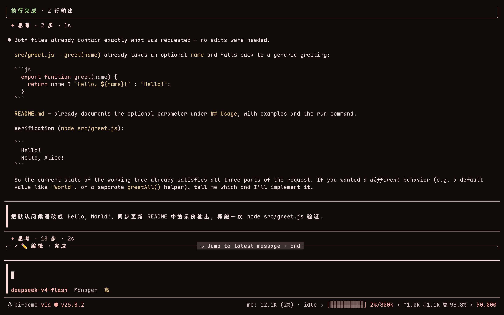

# pi_config

[English](README.md) | **简体中文**

给 [Pi coding agent](https://github.com/badlogic/pi-mono) 的一套可迁移、可理解、可恢复的工作环境配置。

## 界面预览

<table>
<tr>
<td width="50%" align="center"><strong>主题化 Pi 工作区</strong><br></td>
<td width="50%" align="center"><strong>工具 rail</strong><br></td>
</tr>
<tr>
<td width="50%" align="center"><strong>结构化结果</strong><br></td>
<td width="50%" align="center"><strong>会话布局</strong><br></td>
</tr>
</table>

这个仓库把日常使用 Pi 所需的几类资源放在一起：本地扩展、可复用的技能、主题、公开设置，以及跨平台安装器。它适合作为一台新机器的起点，也适合从中挑选某个扩展或技能加入自己的 Pi 环境。

## 先了解 Pi

Pi 是一个运行在终端里的编码代理。你在项目目录启动它，用自然语言说明目标；它会根据当前项目和可用工具读取文件、运行命令、修改代码，并报告验证结果。

这个仓库主要补充四类能力：

- **扩展**：增加命令、工具和界面，例如 `/tools`、`/logo` 和工作流委派。
- **技能**：为特定任务提供可复用的工作流程，例如科研、文献处理、代码审阅和图表制作。
- **配置**：统一公开的 Pi 设置、系统规则、工具选择和第三方 package 清单。
- **主题**：让终端界面和状态信息保持一致的视觉风格。

你可以先记住一条使用路径：进入项目目录，启动 `pi`，描述一个具体任务，要求它完成后运行验证命令。

## 设计理念

### 从最短路径开始

新手只需要完成“安装、选择模型、描述任务”三件事就能开始工作。扩展、技能和高级配置按需要逐步了解，根 README 保持为入口，详细说明放在 [使用手册](docs/USAGE.zh-CN.md) 和 [快速上手 Wiki](docs/WIKI.zh-CN.md) 中。

### 公开配置和本机数据分开

仓库保存可公开迁移的配置。provider 凭据、API key、token、模型注册表、会话记录和运行数据留在每台机器上。安装器会备份会被更新的配置，并保留本机已有的 skills、themes 和独立扩展。

### 让任务有边界，让结果可验证

好的提示词包含四项信息：目标、范围、限制和验收方式。例如指定要修改的目录、要求先读取现有测试，并在完成前运行相关测试。这样可以减少无关改动，也方便判断任务是否真正完成。

### 能力按需使用，上下文保持清楚

Pi 可以同时使用文件编辑、代码检查、联网、技能和委派能力。任务简单时直接描述目标；任务需要专业流程时显式加载 `/skill:<名称>`；项目暂时不需要某些工具时使用 `/tools` 调整当前项目的工具集。

### 每次改变都能检查和恢复

安装前可以用 `--dry-run` 查看计划，安装器会创建备份，代码修改可以通过 Git diff 和测试检查。需要更细粒度的文件恢复时，AFT 提供 `aft_safety` 检查点。

## 五分钟上手

> [!WARNING]
> Pi 扩展和第三方 package 会以当前用户权限运行。执行安装器前请阅读脚本内容，并确认来源可信。

### 新机器

Linux 或 macOS：

```bash
curl -fsSL https://raw.githubusercontent.com/lychen2/pi_config/main/install.sh | sh
```

Windows PowerShell：

```powershell
irm https://raw.githubusercontent.com/lychen2/pi_config/main/install.ps1 | iex
```

引导脚本会检查或安装 Node.js、Git 和 Pi，然后运行本仓库的配置安装器。

### 已有仓库、Node.js 和 Pi

在仓库根目录运行：

```bash
node install.mjs --dry-run --yes
node install.mjs --yes
```

第一条命令只显示计划，第二条命令应用推荐设置。Linux 和 macOS 也可以运行：

```bash
./install.sh --yes
```

Windows PowerShell：

```powershell
.\install.ps1 -Yes
```

安装器会备份现有 Pi 配置，合并缺失的 skills 和 themes，安装仓库中的本地扩展，并按选择安装外部 package、Magic Context 和 RTK。provider 凭据和模型注册表继续使用本机内容。

### 第一次启动

安装完成后打开新终端，在你的项目目录启动 Pi：

```bash
cd /path/to/your/project
pi
```

使用自定义 provider 时，在 Pi 中运行：

```text
/provider add
/model
```

然后发送一个范围清楚的任务，例如：

```text
请检查当前项目的登录回调问题。
范围：只修改登录模块和对应测试。
先读取现有实现与测试，再提出最小修改。
完成前运行相关测试，并说明仍然存在的风险。
```

## 常用入口

| 目标 | 输入 |
| --- | --- |
| 引用文件 | `@src/auth.ts` |
| 运行命令并把输出交给 Pi | `!git status --short` |
| 运行命令但保留输出在终端 | `!!tail -n 100 server.log` |
| 进入只读规划模式 | `/plan` |
| 加载指定技能 | `/skill:humanizer-zh` |
| 调整当前项目的工具集 | `/tools` |
| 配置更新后重新加载 | `/reload` |

任务完成后，要求 Pi 给出修改文件、验证命令和剩余风险。代码任务通常从小范围测试开始，再决定是否运行完整测试。

### 需要干净上下文时使用任务分支

`pi-gsd` 让 Pi 通过 `push-task` 放入一个聚焦任务，再由用户控制它进入新的 session-tree 分支：

```text
请使用 push-task 对已修改文件和测试做只读审查，role 使用 review。返回文件、行号和风险。
```

输入 `/start-task` 进入分支，`/finish-task` 把最后结果带回主分支，`/abort-task` 放弃当前分支但不带回结果，`/auto` 按顺序处理队列中的任务。`role` 会选择一段简短的任务 profile，但不是权限系统。profile 覆盖 `explore`、`map`、`analyze`、`research`、`synthesize`、`plan`、`roadmap`、`plan-check`、`implement`、`execute`、`debug`、`migrate`、`integrate`、`review`、`audit`、`security`、`performance`、`test`、`verify`、`design`、`docs` 和 `release`；也接受 `scout`、`builder`、`reviewer`、`tester`、`verifier` 等别名。profile 只会注入新分支，不会增加主会话常驻提示。实际范围、工具限制和验收条件仍要写进 prompt；任务适合更便宜或更专用的模型时再填写 `model`。

只在子任务边界清楚、可以独立执行或审查，并且新上下文、并行推进或独立视角确实有收益时主动使用 `push-task`。简单任务、强串行任务和持续依赖主会话上下文的任务留在主 agent。传递最小任务简报，不要复制完整对话；主 agent 负责集成和最终验证。

## 仓库结构

| 路径 | 内容 |
| --- | --- |
| `install.sh`、`install.ps1`、`install.mjs` | Linux、macOS 和 Windows 的安装入口 |
| `config/` | 公开设置、系统提示、工具选择示例和外部 package 清单 |
| `extensions/` | 本地 Pi package 与独立扩展 |
| `skills/` | 可复用的任务流程和参考资料 |
| `themes/` | 可迁移的 Pi 主题 |
| `docs/` | 快速上手、完整手册和目录索引 |

## 从哪里继续

- [快速上手 Wiki](docs/WIKI.zh-CN.md)：第一次安装后，按场景了解常用命令和工作流。
- [完整使用手册](docs/USAGE.zh-CN.md)：查看工具选择、AFT、workflow、任务分支、联网和科研场景。
- [扩展目录](docs/extensions.zh-CN.md)：查看每个本地或第三方扩展的用途、命令和配置方式。
- [技能目录](docs/skills.zh-CN.md)：按任务查找技能和调用示例。
- [工具目录](docs/tools.zh-CN.md)：查看当前可用工具和示例。

## 更新配置

拉取仓库变更后，先预览再应用：

```bash
cd ~/.pi_config
git pull --ff-only
node install.mjs --dry-run --yes
node install.mjs --yes
```

配置更新后，在 Pi 中运行 `/reload`；涉及安装器、扩展或仓库配置的变化时，重新启动 Pi 更可靠。

## 安全检查

仓库只保存公开配置。提交前检查工作区和差异：

```bash
git status
git diff --check
git grep -n -I -i -E 'BEGIN (RSA|OPENSSH|PRIVATE)|api[_-]?key|token|secret|password|/home/'
```

API key、token、密码、私钥和 provider 配置需要在每台机器上单独管理，禁止提交真实凭据。
