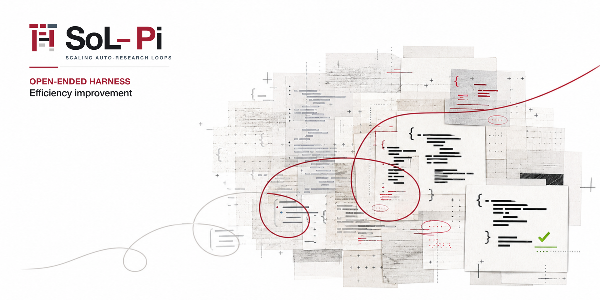

<p align="center">
  
</p>

# ⚡ SoL-Pi: Scaling Auto-Research Loops for Efficient Agent Harnesses

<p align="center">
  <a href="https://arxiv.org/abs/2609.20519"></a>
  <a href="#getting-started"></a>
  <a href="docs/configuration.md"></a>
  <a href="https://nvlabs.github.io/SoL-Pi/"></a>
  <a href="LICENSE"></a>
</p>

> [!NOTE]
> This repository contains the open-source version of SoL-Pi, a standalone extension for [Pi](https://github.com/earendil-works/pi). It is not an official distribution of Pi.

## 💡 TL;DR

**Spend less without making the agent do less useful work.**

SoL-Pi is a standalone extension for Pi that packages four reusable efficiency mechanisms discovered through scaled auto-research loops. It reduces repeated model turns, context replay, oversized observations, and unnecessary long-log reading while preserving the work and evidence an agent needs to finish a task.

SoL-Pi installs on top of an unmodified Pi release. Every mechanism is opt-in and disabled by default.

## Introduction

Long-running coding agents accumulate repeated work. A file edit is often followed by a predictable validation command. Large tool results are replayed long after their first use. Completed subtasks remain in active context, and a frontier model may spend a full request reading a log when only a few lines affect the next decision.

SoL-Pi grew out of a broader question from our auto-research work: before scaling agent loops, can agents first make the harness itself more efficient? The search focused on constrained efficiency: reducing token traffic, inference work, and agent turns without stopping early, skipping verification, or hiding evidence.

The standalone release contains four mechanisms that survived that process. They operate at different parts of the harness and compose through Pi's public extension APIs.

## What SoL-Pi Adds

| Area | Mechanism | What changes |
|---|---|---|
| Tools | **Action Fusion** | An edit or write can run its follow-up validation command in the same tool call. |
| Observations | **ObservationPack** | Repeated large text results become stable handles with exact paged recall. |
| Delegation | **Evidence-Preserving Reducer** | Long diagnostic logs become compact receipts only when every retained quotation matches the archived source. |
| Context | **Online Context Compact** | Completed plan steps become candidate points for Pi's native compaction, subject to economic and window-pressure checks; after a successful compaction, Pi continues the task in a new turn. |

The mechanisms share four rules:

- **No Pi patches.** SoL-Pi imports public Pi APIs and does not vendor the Pi source tree.
- **Explicit opt-in.** A missing configuration leaves every mechanism disabled.
- **Preserve evidence.** Original observations remain available locally, and reducer failures leave the original result unchanged.
- **Use Pi's runtime choices.** Authentication, provider URLs, the main model, and shell behavior remain under Pi's control.

## Technical Details and Core Insights

Read the [SoL-Pi blog](https://nvlabs.github.io/SoL-Pi/) for a deeper look at the technical details, design rationale, and core insights behind SoL-Pi, including how auto-research led to the four efficiency mechanisms and how they work.

## Paper

Read our paper: [SoL-Pi: Recursively Scaling Auto-Research Loops for Efficient Agent Harness](https://arxiv.org/abs/2609.20519).

## Getting Started

### Requirements

- Node.js 22.19 or newer
- npm
- `@earendil-works/pi-coding-agent` 1.0.x (development baseline 1.0.0)

### Install

This copy is the pi_config maintained fork. The default profile loads it through `pi-context-bridge` and its local file dependency; use the repository installer and keep that single registration. See [FORK.md](FORK.md) for the upstream revision, selected PRs and maintenance procedure.

For independent use outside the default profile, install Pi 1.0.0 and register this local source directory:

```bash
npm install --global --ignore-scripts @earendil-works/pi-coding-agent@1.0.0
pi install /absolute/path/to/pi_config/vendor/sol-pi --approve
```

Add `--local` for project-local scope in a trusted project. Preserve an existing Pi installation and its credentials when integrating this fork.

### Configure

SoL-Pi uses a single effective configuration. With the official Pi distribution, it looks for a `sol-pi.json` file in the following locations, in order:

1. `.pi/sol-pi.json` in the current project, if the project is trusted and the file exists;
2. `~/.pi/agent/sol-pi.json` otherwise.

If neither file exists, SoL-Pi uses its built-in defaults. The project-level configuration takes precedence over the user-level configuration; the two files are not merged.

The following conservative configuration enables only the two local mechanisms that make no additional model calls and do not stop an active run:

```json
{
  "version": 1,
  "actionFusion": true,
  "observationPack": true,
  "evidencePreservingReducer": false,
  "onlineContextCompact": false,
  "observationPackFullSends": 2,
  "cacheWriteReadRatio": 12.5
}
```

Set `observationPackFullSends` to `0` when the provider bills prompt caching and the context is large: Observation Pack then projects the placeholder from the first provider request, so a message never changes after it has been sent and the cached prefix stays valid. See [Configuration](docs/configuration.md#observationpackfullsends) for the measured trade-off.

Enable additional mechanisms only after reviewing their configuration and security implications. SoL-Pi uses no dedicated environment variables; feature flags, the Observation Pack full-send count, the reducer provider/model route, and the compaction ratio are configured in `sol-pi.json`. See [sol-pi.example.json](sol-pi.example.json) for a template listing every key.

For the complete schema, see [Configuration](docs/configuration.md). Coding agents and automated environments should follow the canonical [agent installation and configuration protocol](agents-install.md), which describes an all-enabled configuration checked with `scripts/check-sol-pi-config.mjs --require-all-enabled`.

## Storage and Security

ObservationPack and Evidence-Preserving Reducer store session-specific archives under:

```text
<session-directory>/sol-pi/<session-id>/
├── observation-pack/
└── evidence-preserving-reducer/
```

They archive eligible source material in this directory. The archived copies remain local and are not automatically deleted when the Pi session ends.

With `pi --no-session` or `SessionManager.inMemory()`, Pi provides no session directory. SoL-Pi instead creates a private directory named `sol-pi-<session-id>-<random>/` under the operating system's temporary directory. ObservationPack and Evidence-Preserving Reducer share this directory for the lifetime of the loaded extension. These modes disable Pi's session-log persistence; SoL-Pi still writes archive files for exact recall. Temporary archives are also retained after the session or worker exits so callers can read referenced evidence. Their eventual cleanup follows the host's temporary-file policy or the caller's cleanup, and they are not guaranteed to survive system cleanup or support session recovery.

Online Context Compact stores its state in Pi's session log. After a successful compaction, it starts a new turn and automatically continues the active task. Cancelling the run or exiting Pi does not trigger automatic continuation.

Evidence-Preserving Reducer may send eligible diagnostic-log content to its configured reducer model using Pi-managed authentication. Review [SECURITY.md](SECURITY.md) before enabling it. Do not enable remote reduction for logs that must remain local.

## Documentation

| Document | Purpose |
|---|---|
| [Configuration](docs/configuration.md) | Config search order, schema, defaults, and trust behavior |
| [Compatibility](docs/compatibility.md) | Supported Pi APIs and standalone integration details |
| [Security](SECURITY.md) | Local storage, remote reduction, and sensitive behavior |
| [Agent installation](agents-install.md) | Reproducible installation and all-enabled validation procedure |

## Development

Install from the lockfile and run the complete source checks:

```bash
npm ci --ignore-scripts
npm run check
npm audit --audit-level=high
node scripts/check-pi-compat.mjs
```

`npm run check` covers TypeScript, the complete test suite, and package inspection. The development dependency set is pinned to Pi 1.0.0; runtime Pi packages remain peer dependencies so Pi owns their installation and upgrades.

## Project Status

The upstream SoL-Pi extension is developed by NVIDIA. This copy is maintained in pi_config; local changes and verification are documented in [FORK.md](FORK.md). [CONTRIBUTING.md](CONTRIBUTING.md) describes upstream contribution requirements.

## Acknowledgements

SoL-Pi builds on the public extension interfaces provided by [Pi](https://github.com/earendil-works/pi). Pi remains an independent upstream project and is not vendored into this repository.

## License

SoL-Pi is released under the [MIT License](LICENSE).

## Star History

<a href="https://www.star-history.com/?repos=NVlabs%2FSoL-Pi&amp;type=date">
  <picture>
    <source media="(prefers-color-scheme: dark)" srcset="https://raw.githubusercontent.com/NVlabs/SoL-Pi/star-history/star-history-dark.svg" />
    <source media="(prefers-color-scheme: light)" srcset="https://raw.githubusercontent.com/NVlabs/SoL-Pi/star-history/star-history-light.svg" />
    
  </picture>
</a>
